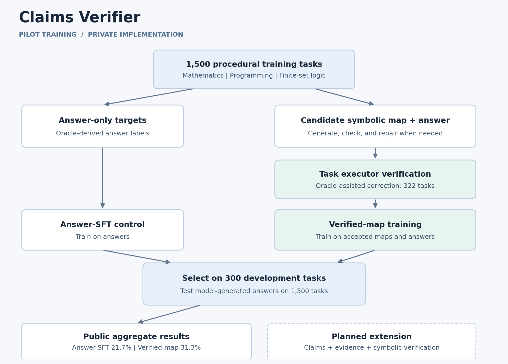

# Claims Verifier

We study whether language models can learn computable representations of a problem and use them to produce verifiable answers. Our goal is to extend this approach to claims and evidence in source material.

E6 is a Qwen3-8B model fine-tuned on **1,500 synthetic math, programming and logic tasks** using set-based representations. On the same **300 development tasks**, E6 at the fixed update-100 checkpoint scored **89.33% (268/300)**, compared with **23.00% (69/300)** for Original Qwen3-8B, under matched prompts, decoding and strict answer scoring. These are previously inspected instances of familiar task families. Output formatting affects this comparison; see the [result interpretation](results/README.md#result-interpretation).

These results demonstrate improved performance on custom tasks, but a gap remains in transferring that ability to unfamiliar source material.

The [dataset and reusable tools](datasets/e6_custom_v1/README.md) include prompts, reference maps, answers, a bounded executor and scoring utilities. The [technical report](docs/E6_TECHNICAL_REPORT.md) explains the comparison and its limitations.

```bash
python -B -m datasets.e6_custom_v1.dataset validate
```




- [E6 results](results/README.md): Matched Original/E6 development results.
- [Benchmark status](benchmarks/README.md): completed evaluations, pending comparisons and transfer limits.
- [Illustration](demo/index.html): a standalone symbolic-computation demo; download and open it in a browser. It does not run the trained model.

## Research scope

The E6 result concerns generated mathematics, programming and finite-set logic tasks. It does not establish mastery of arbitrary natural-language claims. See the [result interpretation](results/README.md#result-interpretation) for the output-format diagnostic and limits of the matched comparison.

This release does not report downstream fact-verification comparisons or establish reliable transfer to unseen sources.

## License and citation

The [MIT license](LICENSE) covers the materials supplied in this public repository, including its educational demonstrations and the E6 synthetic dataset and utilities. The full training pipeline and model weights are not included. Third-party models and datasets retain their own licenses. See [CITATION.cff](CITATION.cff) for a repository citation; this project does not claim an accepted paper or DOI.
