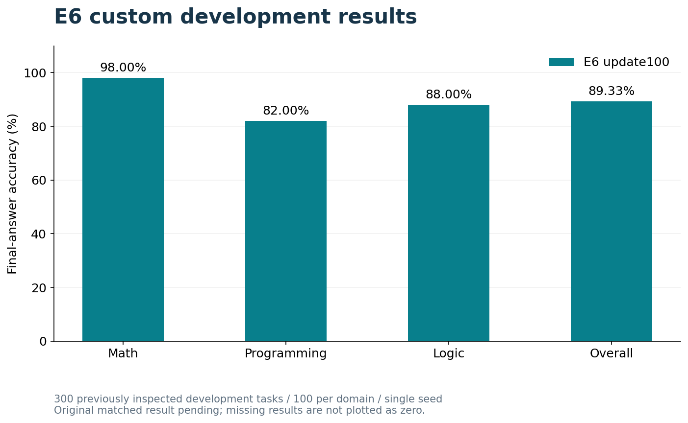

# E6 results

## E6: custom development tasks

E6 was trained on 1,500 synthetic tasks and evaluated at the fixed update-100 checkpoint on 300 different, previously inspected development instances from familiar families. On the same 300 development tasks with matched prompts, decoding and scoring, **Original Qwen3-8B scored 69/300 (23.00%)**, compared with **E6's 268/300 (89.33%)**. Both completed runs passed saved-response identity and score-replay checks.

| Domain | E6 correct / tasks | E6 accuracy | Original |
|---|---:|---:|---|
| Math | 98 / 100 | 98.00% | 50 / 100 (50.00%) |
| Programming | 82 / 100 | 82.00% | 19 / 100 (19.00%) |
| Logic | 88 / 100 | 88.00% | 0 / 100 (0.00%) |
| **Overall** | **268 / 300** | **89.33%** | 69 / 300 (23.00%) |

All 300 E6 outputs parsed as JSON; 267 met the strict reference-map contract. Answer correctness is scored separately from map validity. These are single-seed development results, not evidence of reliable transfer to unseen source material or a causal benefit from set representations. See the [evaluation dataset](../datasets/e6_evaluation_v1/README.md) and [saved aggregate](e6_custom_v1/e6_update100_summary.json).

## Result interpretation

**Output formatting accounts for part of the difference.** Original returned a bare `{"answer": [...]}` object on all 100 logic tasks instead of the required `{"final_answer": {"answer": [...]}}`. Strict scoring therefore gives Original 0/100 on logic. A post hoc diagnostic, applied to both models without changing answer values, recognizes 29 correct bare logic answers: Original becomes 98/300 (32.67%), while E6 remains 268/300 (89.33%). This diagnostic does not replace the official scores or establish general logical competence. [Diagnostic rule and counts](e6_custom_v1/logic_wrapper_diagnostic.json).

E6 answers **268/300 development tasks correctly (89.33%)**. It performs best on math (98/100), followed by logic (88/100) and programming (82/100). The domain differences identify where this custom-task evaluation succeeds and where errors remain.

**Answer accuracy and map validity are different outcomes.** All 300 E6 outputs parse as JSON; 267 satisfy the strict reference-map contract. A valid map must match the supported task-bound structure. This count does not establish faithful interpretation of arbitrary paragraphs, and correct final answers do not necessarily contain valid maps.

**The comparison is within familiar task families.** Training uses 1,500 tasks; evaluation uses 300 different instances that were previously inspected during development. The matched Original control has completed and passed replay. This comparison measures the effect of the complete E6 fine-tuning procedure relative to the unadapted base under the shared output contract. It does not isolate a causal benefit of set maps from additional training or format learning; that requires matched training controls.

These results demonstrate improved performance on custom tasks, but a gap remains in transferring that ability to unfamiliar source material.

This is one training seed with automated checking and no expert review. Broader robustness and independent reproduction remain unestablished.

Matched paired outcomes: both_correct=69, original_only=0, e6_only=199, both_wrong=32. See [comparison evidence](e6_custom_v1/matched_comparison.json).

## Evidence files

- [Matched Original/E6 aggregate](e6_custom_v1/matched_comparison.json)
- [E6 update100 summary](e6_custom_v1/e6_update100_summary.json)
- [Output-format diagnostic](e6_custom_v1/logic_wrapper_diagnostic.json)
- [Evaluation dataset](../datasets/e6_evaluation_v1/README.md)

The current release includes evaluation task inputs and gold answers. It excludes training data, method-specific prompts, reference maps, the executor, model weights and raw evaluation responses. Saved-output replay is not independent reproduction of training or inference.
